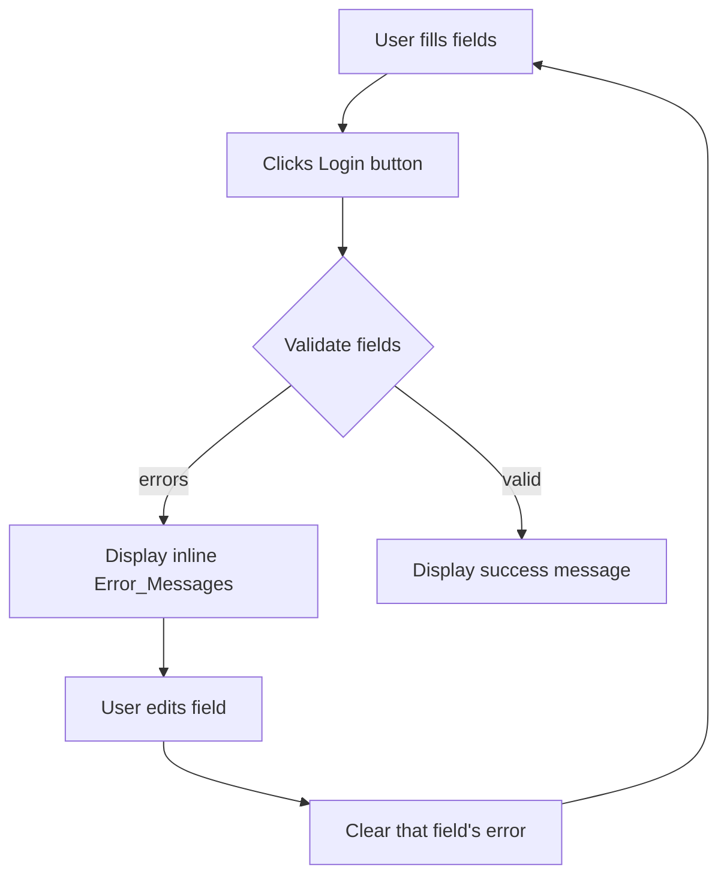

# Design Document: Login UI

## Overview

This feature delivers a client-side-only login form built with React (TypeScript) and Vite. It runs locally on a Windows laptop via `npm run dev` (Vite dev server). There is no backend — all validation logic lives in the browser. The form collects a username and password, validates them client-side, and displays either inline error messages or a success message. A "Created by Kiro" header banner is rendered at the top of the page.

**Key constraints:**
- React + TypeScript (Vite scaffold)
- CSS Modules for scoped styling
- No external form libraries (react-hook-form, Formik, etc.) — keep it minimal
- No backend calls
- Fully keyboard-navigable and screen-reader-friendly

---

## Architecture

The application is a single-page React app with no routing. The component tree is shallow:

```
App
├── Header ("Created by Kiro")
└── LoginForm
    ├── FormField (Username)
    │   └── ErrorMessage
    ├── FormField (Password)
    │   └── ErrorMessage
    ├── SubmitButton
    └── SuccessMessage (conditional)
```

All state lives in `LoginForm`. No global state manager is needed.



**File layout (inside `src/`):**

```
src/
  components/
    LoginForm/
      LoginForm.tsx          # Main form component
      LoginForm.module.css   # Scoped styles
      FormField.tsx          # Reusable labelled input wrapper
      FormField.module.css
      SuccessMessage.tsx     # Success banner
      SuccessMessage.module.css
  utils/
    validation.ts            # Pure validation functions
  types/
    login.ts                 # Shared TypeScript types
  App.tsx                    # Renders Page_Header + LoginForm
  App.module.css             # Header and page layout styles
  main.tsx
```

---

## Components and Interfaces

### `App`

The root component. Renders the page header and the `LoginForm`.

```tsx
// App.tsx
function App() {
  return (
    <div className={styles.wrapper}>
      <header className={styles.header}>
        <h1>Created by Kiro</h1>
      </header>
      <main>
        <LoginForm />
      </main>
    </div>
  )
}
```

### `LoginForm`

The top-level form component. Owns all state.

```typescript
// State shape
interface LoginFormState {
  username: string;
  password: string;
  errors: FieldErrors;
  submitted: boolean; // true when validation passes
}

interface FieldErrors {
  username?: string;
  password?: string;
}
```

**Behaviour:**
- On mount: all fields empty, no errors, `submitted = false`
- On field change: update field value; if an error exists for that field, clear it immediately
- On submit: run `validate(username, password)` → if errors, set them; if clean, set `submitted = true`

### `FormField`

A reusable wrapper that renders a `<label>`, an `<input>`, and an optional error message.

```typescript
interface FormFieldProps {
  id: string;
  label: string;
  type: 'text' | 'password';
  value: string;
  onChange: (value: string) => void;
  error?: string;
}
```

- `<label htmlFor={id}>` links to `<input id={id}>`
- When `error` is truthy, renders `<span id={`${id}-error`} role="alert">{error}</span>` and sets `aria-describedby={`${id}-error`}` on the input

### `SuccessMessage`

A simple presentational component rendered when `submitted === true`.

```typescript
interface SuccessMessageProps {
  message: string; // "Login successful!"
}
```

### `SubmitButton`

A native `<button type="submit">Login</button>`. No special props beyond standard button attributes.

---

## Data Models

### `FieldErrors`

```typescript
interface FieldErrors {
  username?: string; // undefined = no error
  password?: string;
}
```

### `ValidationResult`

Returned by the pure `validate` function in `utils/validation.ts`.

```typescript
interface ValidationResult {
  valid: boolean;
  errors: FieldErrors;
}
```

### Validation Rules

| Field    | Rule                        | Error message                              |
|----------|-----------------------------|--------------------------------------------|
| username | Must not be empty           | "Username is required"                     |
| username | Must be ≥ 3 characters      | "Username must be at least 3 characters"   |
| password | Must not be empty           | "Password is required"                     |
| password | Must be ≥ 6 characters      | "Password must be at least 6 characters"   |

Empty-field check takes priority over minimum-length check for each field (only one error per field at a time).

---

## Correctness Properties

*A property is a characteristic or behavior that should hold true across all valid executions of a system — essentially, a formal statement about what the system should do. Properties serve as the bridge between human-readable specifications and machine-verifiable correctness guarantees.*

### Property 1: Empty username always produces a validation error

*For any* password string, when the username field is empty (zero-length string), the validation result SHALL contain a non-empty error string for the username field and `valid` SHALL be `false`.

**Validates: Requirements 2.1, 2.4**

---

### Property 2: Empty password always produces a validation error

*For any* username string, when the password field is empty (zero-length string), the validation result SHALL contain a non-empty error string for the password field and `valid` SHALL be `false`.

**Validates: Requirements 2.2, 2.4**

---

### Property 3: Short username always produces a validation error

*For any* non-empty username string with length 1 or 2, the validation result SHALL contain a non-empty error string for the username field and `valid` SHALL be `false`.

**Validates: Requirements 3.1, 3.3**

---

### Property 4: Short password always produces a validation error

*For any* non-empty password string with length between 1 and 5 inclusive, the validation result SHALL contain a non-empty error string for the password field and `valid` SHALL be `false`.

**Validates: Requirements 3.2, 3.3**

---

### Property 5: Valid inputs always produce no errors

*For any* username with length ≥ 3 and password with length ≥ 6, the validation result SHALL have `valid = true` and both `errors.username` and `errors.password` SHALL be `undefined`.

**Validates: Requirements 4.1**

---

### Property 6: Editing a field with an error clears only that field's error

*For any* form state that has an error for a given field (username or password), modifying that field's value SHALL result in the error for that field being cleared (set to `undefined`), while errors for the other field remain unchanged.

**Validates: Requirements 5.1, 5.2**

---

### Property 7: aria-describedby is set on inputs with active errors

*For any* rendered `FormField` component where the `error` prop is a non-empty string, the input element SHALL have an `aria-describedby` attribute pointing to the id of the rendered error element.

**Validates: Requirements 6.3**

---

## Error Handling

| Scenario | Behaviour |
|---|---|
| Both fields empty on submit | Both error messages shown simultaneously; form not submitted |
| Username empty, password valid | Only username error shown |
| Password empty, username valid | Only password error shown |
| Username too short (non-empty) | "Username must be at least 3 characters" shown |
| Password too short (non-empty) | "Password must be at least 6 characters" shown |
| User edits a field with an active error | That field's error clears immediately on change |
| All fields valid on submit | Success message shown; form remains visible |

There are no network errors to handle (no backend). No async operations are involved.

---

## Testing Strategy

### Unit Tests (Vitest + React Testing Library)

Focus on concrete examples and edge cases:

- `validation.ts` — test each rule with specific inputs (empty string, 1-char username, 5-char password, valid inputs)
- `LoginForm` — render test: all three elements present on mount
- `LoginForm` — submit with empty fields: both error messages appear
- `LoginForm` — submit with valid fields: success message appears
- `LoginForm` — edit a field after error: that error disappears
- `FormField` — `aria-describedby` is set when error prop is present; absent when error is undefined

### Property-Based Tests (fast-check)

Each property test runs a minimum of **100 iterations**.

Property-based testing is appropriate here because the validation logic is a pure function (`validate(username, password) → ValidationResult`) with a large input space. Running many random inputs catches boundary conditions that hand-written examples miss.

**Library:** [fast-check](https://github.com/dubzzz/fast-check) (TypeScript-native, works with Vitest)

| Property | Generator | Assertion |
|---|---|---|
| Property 1: Empty username error | `fc.string()` for password | `result.valid === false && result.errors.username !== undefined` |
| Property 2: Empty password error | `fc.string()` for username | `result.valid === false && result.errors.password !== undefined` |
| Property 3: Short username error | `fc.string({minLength:1, maxLength:2})` for username | `result.valid === false && result.errors.username !== undefined` |
| Property 4: Short password error | `fc.string({minLength:1, maxLength:5})` for password | `result.valid === false && result.errors.password !== undefined` |
| Property 5: Valid inputs pass | username `minLength:3`, password `minLength:6` | `result.valid === true && both errors undefined` |
| Property 6: Error clearing on edit | `fc.constantFrom('username','password')` for field; any new value | Error for edited field clears; other field error unchanged |
| Property 7: aria-describedby on error | `fc.string({minLength:1})` for error prop | Input has `aria-describedby` pointing to error element id |

**Tag format for each test:**
```
// Feature: login-ui, Property N: <property_text>
```

### Accessibility Checks

- Manual keyboard navigation test: Tab order Username → Password → Login button
- `aria-describedby` verified via RTL `getByRole` + `aria-describedby` attribute assertions
